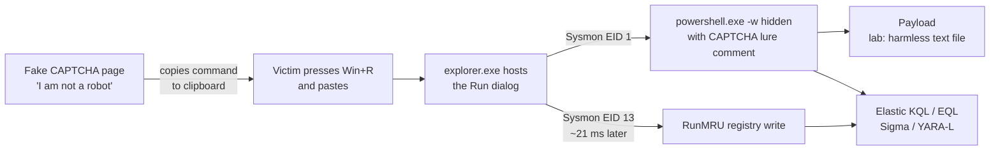
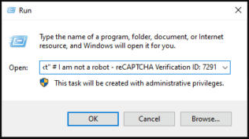
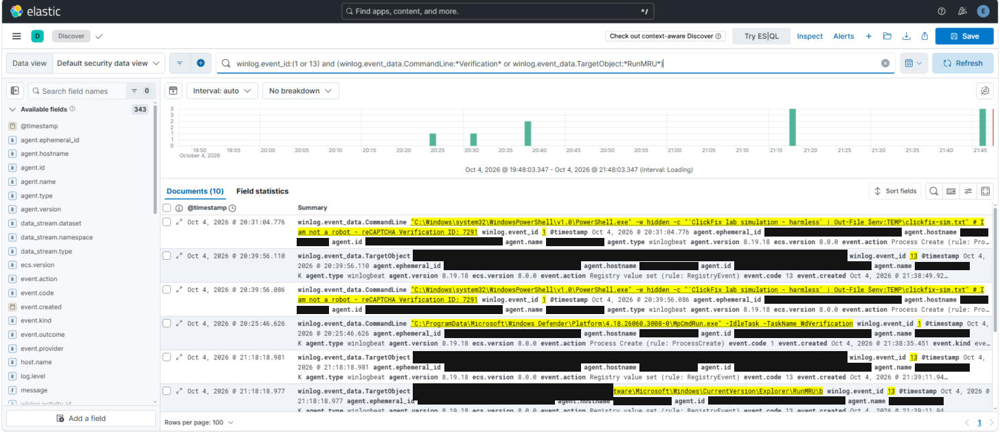
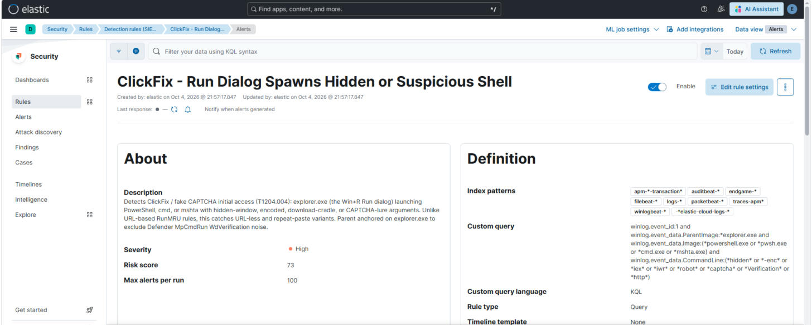
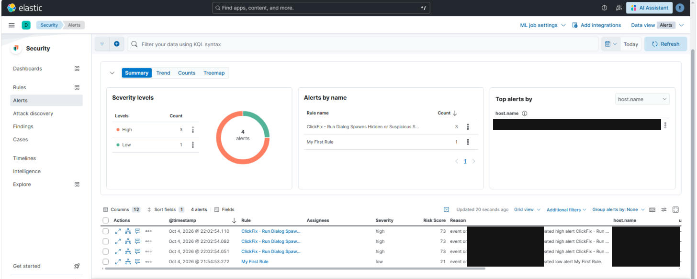

# ClickFix Detection Portability Lab

**One attack, three rule formats, two SIEMs.** I simulated a current ClickFix (fake CAPTCHA) initial-access chain in my Active Directory lab, detected it in Elastic Security, and translated the same detection into Sigma and Google SecOps YARA-L. Along the way I found silent failures in my own SIEM pipeline and two gaps in the public SigmaHQ ClickFix rule.

The project is also written up as a control assessment: each finding is mapped to NIST 800-53 controls, rated, and tracked in a Plan of Action and Milestones (POA&M), the same way findings are handled under RMF and FedRAMP continuous monitoring.
## Contents
- [Why this matters (real world)](#why-this-matters-real-world)
- [Attack flow](#attack-flow)
- [Environment](#environment)
- [Phase 1: Telemetry, and the gap I had to fix first](#phase-1-telemetry-and-the-gap-i-had-to-fix-first)
- [Phase 2: Elastic detection](#phase-2-elastic-detection)
- [Phase 3: Write once in Sigma, deploy anywhere](#phase-3-write-once-in-sigma-deploy-anywhere)
- [Phase 4: Google SecOps YARA-L](#phase-4-google-secops-yara-l)
- [How this improves on the public SigmaHQ rule](#how-this-improves-on-the-public-sigmahq-rule)
- [Results](#results)
- [Known evasion and limitations](#known-evasion-and-limitations)
- [Pipeline incidents I found and fixed](#pipeline-incidents-i-found-and-fixed)
- [Triage playbook](#triage-playbook)
- [Reproduce it](#reproduce-it)
- [MITRE ATT&CK mapping](#mitre-attck-mapping)
- [NIST 800-53 control mapping](#nist-800-53-control-mapping)
- [Control assessment and POA&M](#control-assessment-and-poam)
- [Repository structure](#repository-structure)
- [Next steps](#next-steps)

## Why this matters (real world)
ClickFix tricks a user into "fixing" a fake error or passing a fake CAPTCHA by pasting a command into the Windows Run dialog (Win+R). The victim runs the payload themselves, so there is no exploit and no malicious attachment to scan.
- **Singapore CSA advisory (July 2025):** ClickFix campaigns against the hospitality sector delivered DCRAT, NetSupport RAT, Latrodectus, and Lumma Stealer through fake error dialogs.
- **Microsoft Threat Intelligence (disclosed March 2026):** a February 2026 campaign moved the paste target from the Run dialog to **Windows Terminal** to blend in with admin activity and slip past Run-dialog detections, delivering Lumma Stealer.
- MITRE ATT&CK now tracks this as its own sub-technique, **T1204.004 User Execution: Malicious Copy and Paste**.

## Attack flow


## Environment
Built on the same lab as my [AD Identity Attack Detection Lab](https://github.com/shahoahmed/ad-identity-attack-detection-lab).

| Component | Detail |
|-----------|--------|
| SIEM | Elastic Stack 8.19 (Elasticsearch, Kibana, Elastic Security), Basic license |
| Endpoint | Windows Server 2022 domain controller |
| Telemetry | Sysmon 15.21 (SwiftOnSecurity config, extended below), Winlogbeat 8.19 |
| Rule formats | Sigma, KQL, EQL, Google SecOps YARA-L 2.0 |
| Conversion | sigma-cli with pySigma Elasticsearch backend and a custom pipeline |
| Virtualization | Oracle VirtualBox |

## Phase 1: Telemetry, and the gap I had to fix first
I ran a **safe** simulation: a URL-less command pasted into Win+R that only writes a text file, wrapped in the same fake reCAPTCHA comment real lures use.



**Finding:** the widely used SwiftOnSecurity Sysmon config captured the process creation (EID 1) but **did not log RunMRU writes at all**, so the strongest ClickFix artifact was invisible. I added one rule:
```xml
<TargetObject name="technique_id=T1204.004,technique_name=ClickFix RunMRU" condition="contains">\Explorer\RunMRU</TargetObject>
```
After reloading, both events fired. Timing detail: **the shell process is created about 21 ms before Explorer writes RunMRU**, which matters for correlation ordering.



## Phase 2: Elastic detection
Custom query rule in Elastic Security (High, risk 73, every 5 minutes). Fields are raw Winlogbeat Sysmon fields because this lab has no Sysmon ECS ingest pipeline.
```
winlog.event_id:1
  and winlog.event_data.ParentImage:*explorer.exe
  and winlog.event_data.Image:(*powershell.exe or *pwsh.exe or *cmd.exe or *mshta.exe)
  and winlog.event_data.CommandLine:(*hidden* or *-enc* or *iex* or *iwr* or *robot* or *captcha* or *Verification* or *http*)
```
**Tuning story:** my first hunting query keyed on the lure text (`*Verification*`) and immediately caught Microsoft Defender's own `MpCmdRun.exe -IdleTask -TaskName WdVerification`. Anchoring on `explorer.exe` as the parent removed it.



Correlation rule (EQL, provided as code in [rules/eql](rules/eql); the live alerts above come from the KQL rule), process first, then registry, within one minute on the same host:
```
sequence by host.name with maxspan=1m
  [any where winlog.event_id : "1" and winlog.event_data.ParentImage : "*\\explorer.exe" and
     winlog.event_data.Image : ("*\\powershell.exe", "*\\pwsh.exe", "*\\cmd.exe", "*\\mshta.exe")]
  [any where winlog.event_id : "13" and winlog.event_data.TargetObject : "*\\Explorer\\RunMRU*"]
```

## Phase 3: Write once in Sigma, deploy anywhere
The source of truth is Sigma ([rules/sigma](rules/sigma)). I converted it with `sigma-cli` and pySigma's Elasticsearch backend.

**Gotcha:** the built-in `ecs_windows_old` pipeline maps to `event_data.*` (Winlogbeat 6), but Winlogbeat 8 without the Sysmon module writes `winlog.event_data.*`. I wrote a small custom pipeline ([winlogbeat8_raw_sysmon.yml](rules/sigma/pipelines/winlogbeat8_raw_sysmon.yml)) that adds the prefix and the Sysmon event ID conditions.
```bash
sigma convert -t lucene -p rules/sigma/pipelines/winlogbeat8_raw_sysmon.yml rules/sigma/proc_creation_win_clickfix_run_dialog_shell.yml
sigma convert -t eql    -p rules/sigma/pipelines/winlogbeat8_raw_sysmon.yml rules/sigma/correlation_bundle_clickfix.yml
```
Converted output is in [rules/converted](rules/converted). The auto-generated correlation needed two hand fixes: it grouped on a host field that does not exist in Winlogbeat 8, and its ordering assumption was backwards for this telemetry.

## Phase 4: Google SecOps YARA-L
Two hand-written YARA-L 2.0 rules over UDM ([rules/yara-l](rules/yara-l)); there is no pySigma backend for Google SecOps.

| Sysmon field (Winlogbeat) | UDM field |
|---|---|
| `winlog.event_id: 1` | `metadata.event_type = "PROCESS_LAUNCH"` |
| `winlog.event_id: 13` | `metadata.event_type = "REGISTRY_MODIFICATION"` |
| `ParentImage` | `principal.process.file.full_path` |
| `Image` | `target.process.file.full_path` |
| `CommandLine` | `target.process.command_line` |
| `TargetObject` | `target.registry.registry_key` |
| `host.name` / `Computer` | `principal.hostname` |

- **Single-event rule:** the explorer-to-shell launch with suspicious arguments.
- **Multi-event rule:** the shell launch and a RunMRU write on the same host, `match: $host over 1m`, risk 90 in `outcome`.

## How this improves on the public SigmaHQ rule
SigmaHQ's *Potential ClickFix Execution Pattern - Registry* (Nextron, 2025) is a single registry event that requires `http://` or `https://` in the RunMRU value. In this lab:
1. **URL-less variants miss it.** My simulation contains no URL.
2. **Repeat pastes miss it.** Re-running a command already in the Run history only updates the `MRUList` ordering value (`Details: a`), so there is no command text to match. My process-chain and correlation rules still fire.
3. It is tagged T1204.001; ATT&CK now has the more specific **T1204.004**.

## Results


| Test | Expected | Result |
|---|---|---|
| ClickFix paste, URL-less, CAPTCHA lure (3 runs in the rule's look-back window) | Alert | **3 of 3 fired, High, risk 73** |
| Defender `MpCmdRun.exe -IdleTask -TaskName WdVerification` | No alert | **No alert** (matched my naive hunting query, excluded by the explorer.exe parent anchor) |
| Other DC activity during the test window | No alert | **0 false positives** from this rule |
| Repeat paste of an identical command (MRUList-only registry write) | Alert | Covered by design: the process-chain rule does not depend on RunMRU content. Live alert test pending |
| Admin opens PowerShell from the Start menu | No alert | Not yet tested (parent is explorer.exe, so a 30-minute baseline of normal admin activity is the next tuning step) |

## Known evasion and limitations
- **Windows Terminal variant (Feb 2026):** if the victim pastes into Windows Terminal instead of Win+R, the parent is not `explorer.exe` and there is no RunMRU write. Next iteration: a rule for `WindowsTerminal.exe`/`OpenConsole.exe` spawning shells with the same lure and cradle markers, plus clipboard-to-terminal heuristics.
- Keyword matching on raw keyword fields is case-sensitive in KQL; the Sigma and YARA-L versions use case-insensitive matching.
- The YARA-L rules are written against UDM but have not yet been run against this lab's data. Google SecOps has no free tier, so testing is limited to Google Cloud Skills Boost lab sandboxes.

## Pipeline incidents I found and fixed
Getting the lab back online surfaced four production-style failures:
1. **Expired license, silent outage.** Kibana sat on "server is not ready yet" because the 30-day trial had lapsed (`current license is non-compliant for [security]`). Fixed with `POST /_license/start_basic`.
2. **Credential rotation broke log shipping for three months.** Rotating the `elastic` password earlier never reached `winlogbeat.yml`, so Winlogbeat logged `401 Unauthorized` on every send. I moved the secret into the **Winlogbeat keystore** (`password: "${ES_PWD}"`) instead of plain text.
3. **Rule starvation.** 1,834 prebuilt rules were enabled on a 4 GB VM, causing execution gaps; my new rule never ran. I disabled the prebuilt set, kept only deliberate custom rules, and raised the SIEM VM from 4 GB / 2 vCPU to 8 GB / 4 vCPU. The ClickFix rule fired on its next run.
4. **Backlog replay.** After the credential fix, Winlogbeat began replaying three months of queued events in order, so fresh events would not arrive for hours. I set `ignore_older: 2h` per event log to skip the stale backlog and get live data flowing in minutes.

Lesson: alert on silence. A "no events from host in 30 minutes" rule would have caught incident 2 in July.

## Triage playbook
1. Confirm parent is `explorer.exe` and the child is a shell with hidden, encoded, cradle, or CAPTCHA-lure arguments.
2. Pull the full command line and decode any `-enc` payload.
3. Check the RunMRU write within one minute on the same host to confirm Run-dialog origin.
4. Look for follow-on network connections (Sysmon EID 3) and file writes (EID 11) from the shell.
5. Check browser history around the timestamp for the fake CAPTCHA page.
6. Isolate the host if any payload was fetched; reset credentials if an infostealer is suspected.
7. Block the lure domain and hunt for the same command line across all hosts.

## Reproduce it
1. Add the RunMRU rule above to your Sysmon config and reload (`Sysmon64 -c config.xml`).
2. Run [simulation/simulate-clickfix.ps1](simulation/simulate-clickfix.ps1); it copies a harmless command to the clipboard.
3. Paste it into Win+R. It writes `%TEMP%\clickfix-sim.txt` and nothing else.
4. Import the rules from [rules/](rules).

## MITRE ATT&CK mapping
| Technique | ID | Where |
|---|---|---|
| User Execution: Malicious Copy and Paste | T1204.004 | All rules |
| Command and Scripting Interpreter: PowerShell | T1059.001 | Process-chain rules |

## NIST 800-53 control mapping
| Control | Name | Evidence in this lab |
|---------|------|----------------------|
| SI-4 | System Monitoring | ClickFix detection rule firing in Elastic Security (3 of 3 runs) |
| AU-2 / AU-12 | Event Logging / Audit Record Generation | Found and closed the RunMRU logging gap in the Sysmon config |
| AU-6 | Audit Record Review, Analysis, and Reporting | Triage playbook for the alert |
| CM-6 | Configuration Settings | Sysmon config change made with a backup and validated reload |
| IA-5 | Authenticator Management | Winlogbeat credential moved from plain text into the keystore |
| CA-7 | Continuous Monitoring | Found and fixed a silent three-month log shipping outage |

## Control assessment and POA&M
Assessment of the lab's monitoring controls before and after this project. Status reflects the lab at time of publishing.

| Control | Assessment question | Finding | Result |
|---------|--------------------|---------|--------|
| AU-12 | Are security-relevant events generated for this technique? | RunMRU writes were not logged by the Sysmon config | Other than satisfied, remediated |
| SI-4 | Is the system monitored for this attack? | No detection existed for ClickFix | Other than satisfied, remediated |
| CA-7 | Would a monitoring outage be noticed? | Log shipping failed for three months with no alert | Other than satisfied, partially remediated |
| IA-5 | Are authenticators protected? | Elastic credential stored in plain text in `winlogbeat.yml` | Other than satisfied, remediated |
| CM-6 | Are configuration changes controlled? | Sysmon config changed with backup and validated reload | Satisfied |

**POA&M** (also in [poam/poam.csv](poam/poam.csv))

| ID | Weakness | Control | Severity | Remediation | Status | Completed / Target |
|----|----------|---------|----------|-------------|--------|--------------------|
| POAM-01 | RunMRU registry writes not logged | AU-12 | Moderate | Added Sysmon RegistryEvent rule for `\Explorer\RunMRU`, reloaded and verified events | Completed | 2026-10-04 |
| POAM-02 | No detection for ClickFix (T1204.004) | SI-4 | High | Built and enabled Elastic rule; 3 of 3 test runs alerted | Completed | 2026-10-05 |
| POAM-03 | Plain-text Elastic credential in Winlogbeat config | IA-5 | High | Moved secret to Winlogbeat keystore (`${ES_PWD}`) | Completed | 2026-10-05 |
| POAM-04 | Silent three-month log shipping outage | CA-7 | High | Credential fixed and shipping restored; "no data from host" alert still to build | Open | 2026-11-01 |
| POAM-05 | SIEM license lapse stopped Kibana | CA-7 | Moderate | Moved cluster to Basic license | Completed | 2026-10-05 |
| POAM-06 | Detection rules starved by 1,834 enabled prebuilt rules on an undersized VM | SI-4 | Moderate | Disabled unused prebuilt rules, raised VM to 8 GB / 4 vCPU | Completed | 2026-10-05 |
| POAM-07 | Windows Terminal ClickFix variant not covered | SI-4 | Moderate | Build rule for shells spawned by Windows Terminal with lure markers | Open | 2026-11-15 |
| POAM-08 | Elastic superuser password exposed in old notes | IA-5 | Moderate | Rotate password and update keystore | Open | 2026-10-15 |

## Repository structure
```
rules/
  sigma/        Sigma source rules, correlation bundle, custom pySigma pipeline
  converted/    sigma-cli output (Lucene, EQL)
  kql/          Elastic Security custom query rule
  eql/          Hand-tuned EQL correlation rule
  yara-l/       Google SecOps single-event and multi-event rules
simulation/     Safe ClickFix simulation script
poam/           Plan of Action and Milestones (CSV)
screenshots/    Redacted evidence
```

## Next steps
- Detection for the Windows Terminal ClickFix variant
- 30-minute baseline of normal admin activity to measure false positives
- Run the YARA-L rules in a Google SecOps lab sandbox
- Silence alert for hosts that stop sending events
- Submit the URL-less and repeat-paste coverage to SigmaHQ
